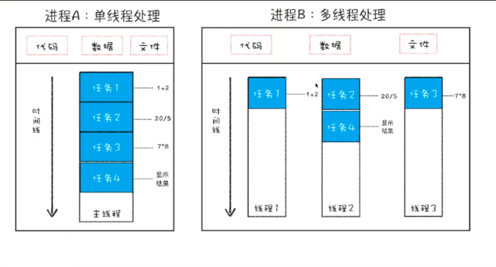

# 浏览器底层原理

- 云操作系统
  - web 程序？
    chrome 足够强的话，可以根据云服务
  - 阿里云  IP  服务
    一台服务器，虚拟化，容器化(docker)
  - LLM 时代，云 算力资源 共享

- 为什么是Chrome？
  - 主流
    - chrome 超越 IE浏览器(Edge) 成为NO.1
    - 国内的浏览器，其实就是chrome 套了个壳子
  - 内核
    - IE 和 非IE  box-sizing  不一样  代码的兼容性?   最痛苦的是前端   PC时代
    - 移动时代 ？   没IE 什么事情  前端就幸福了
      苹果       webkit         内核
      google   基于webkit，开源了 chromium 的浏览器项目(360 等浏览器基于它)
      chrome是chromium的商业版
      - v8 引擎 + 渲染引擎
      - webkit 分了叉 升级为 blink 内核
  - 架构

- 要那么多的进程干嘛？

  - 进程 是操作系统分配资源的最小单位
  - 线程 是CPU调度(执行)的最小单位

  - JS 是 单线程的 简单 可靠
  - 多线程 更快

- 并行操作 快？
  - 进程可以启动多个线程
  - 线程可以共享进程的数据
  - 进程关闭，回收内存
  - 进程之间相互隔离

- 进程间可以通信吗？
  - 多项 相对比较独立的任务
下载任务
- 进程间的通信 IPC 

- Chrome 多进程有哪些？
  - 浏览器主进程
    负责界面显示，用户交互(事件冒泡，捕获机制)，子进程管理(IPC),存储功能(cookie,localStorage,sessionStorage,indexDB) 安全
  - 渲染进程
    排版的Webkit/Blink + v8 引擎(JS 单线程，异步) 在这个进程
    A 页面打开的情况下 B页面也可以打开 A/B 崩溃不影响
    每个tab 都是一个渲染进程，运行在沙箱之中，操作系统等
    比如 GPS 功能，摄像头 等 提醒授权
  - 插件进程
    flash,chrome,extension 安全
  - GPU 进程
    3D 绘制 transform: translate3D(50%，50%，50%)
    显卡 显存 都习惯使用 GPU 来加速

- 从输入URL 到页面显示?
  - 浏览器要打开 启动了4个进程 (多进程架构)