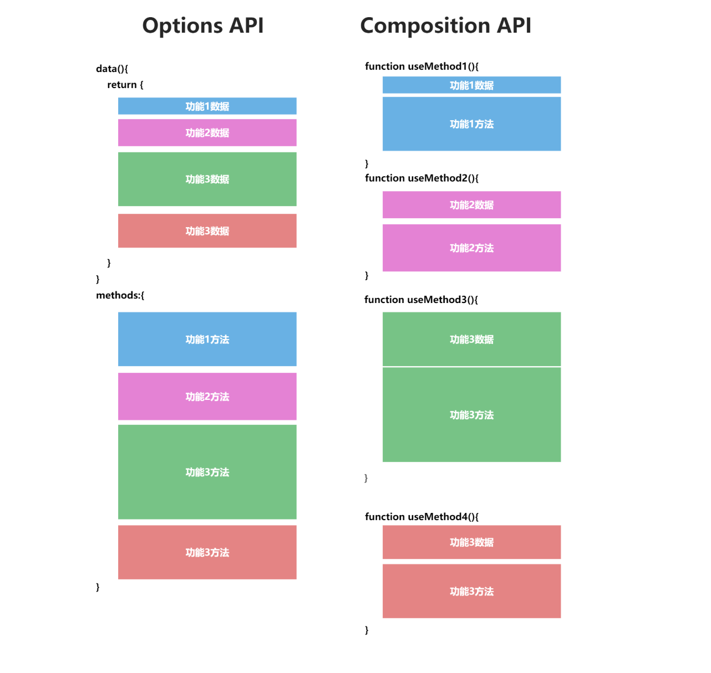

# 双向绑定

- title data
  {{ title }}  数据驱动的界面
  input v-model="title" 
  input 输入时候，输入值改变了，和数据项title 不一样
  @input 麻烦， v-model 专门解决数据双向绑定

- :class  :value ?
  动态绑定属性业务时用: v-bind:  :

- 数据和界面保持一致

- all 所有任务的数量
  - title,todos 不一样  独立
  - all 依赖于对todos 计算
  - computed 计算属性
    - 形式是函数，返回是值
    - 当计算属性函数依赖项发生改变时，会重新执行函数，得到新的值
    - 关注函数体内的 数据属性
    - 计算属性也是数据的一类  可以通过this 访问
    - get set 两种操作，数据属性的特质更明显

- 数据和界面状态的正确性
  - 数据驱动界面 {{}} 单向数据绑定
  - 双向绑定  v-model
    - 先是**界面状态**发生了改变
    - 数据要保持一致
    - v-model 修改数据
    - 状态一致
  - 依赖项的联动一致
    allDone  true/false  todos  也得变

  - 不犯错误， 数据和界面状态一致

- vue 2.0 让开发者 爽  专注于数据业务
  
  data
  methods
  computed
  简单， 缺点是，不灵活
- vue 3.0?
  选项式  ->  setup 组合式   对应的data + method + computed 放一起
  有利于大型项目 (组件代码 > 100行) 的维护
  